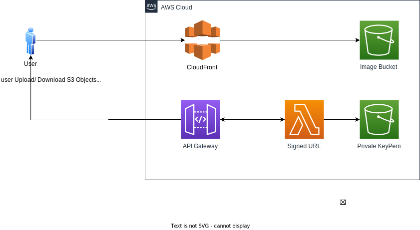

### A demo using AWS CDK
a demo application which use `aws cdk` for building infrastruture

### Application
- users are able to upload/ download an images to S3
- according to to aws security practice, Application should generate `Presigned URL` instead of up/down directly to/from `S3 Bucket`
- overview architecture as bellow
  

### How to deploy

[aws-infra](/aws-infra/README.md)